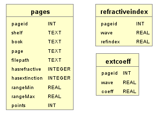

# refractiveindex.info-sqlite

Python 3 + SQLite wrapper for the [refractiveindex.info](http://refractiveindex.info/) database of optical constants by [Mikhail Polyanskiy](https://github.com/polyanskiy).

YML parsing is based on a modified version of `refractiveIndex.py` from the [PyTMM project](https://github.com/kitchenknif/PyTMM) by [Pavel Dmitriev](https://github.com/kitchenknif).

---

## Features

- Build a local SQLite database from the upstream YML folder or directly from a `.zip` URL.
- Search materials by name, shelf/book/page, refractive index (*n*), or extinction coefficient (*k*).
- Run arbitrary SQL queries against the database.
- Load a material and retrieve *n*, *k*, or ε at any wavelength — **scalar or NumPy array input**.
- Query in **any wavelength unit**: nm, µm, m, mm, Å, cm⁻¹, THz, or eV.
- Out-of-range wavelengths return **NaN** instead of raising exceptions, enabling clean vectorised workflows.
- Export optical data to NumPy arrays or CSV files.
- Use `Material.FromLists` to wrap your own *n*/*k* data without a database.

---

## Installation

```bash
pip install .
```

**Dependencies** (declared in `pyproject.toml`, installed automatically):

| Package | Purpose |
|---|---|
| `numpy` | Array operations and interpolation |
| `scipy` | `interp1d` for tabulated data |
| `pyyaml` | Parsing the upstream YML files |
| `requests` | Downloading the database zip |

---

## Quick start

```python
from refractivesqlite import Database

# 1. Create the database once (downloads ~30 MB)
db = Database("refractive.db")
db.create_database_from_url()

# 2. On subsequent runs just open it
db = Database("refractive.db")

# 3. Find a material
db.search_pages("BK7")

# 4. Load and query it
mat = db.get_material(pageid)
print(mat.get_refractiveindex(589))          # n at 589 nm
print(mat.get_refractiveindex(2.48, unit='eV'))   # same point, eV input
print(mat.get_extinctioncoefficient(589))    # k at 589 nm
print(mat.get_epsilon(589))                  # complex permittivity ε = (n+ik)²

# 5. Vectorised query over a wavelength array
import numpy as np
wls = np.linspace(400, 800, 200)             # nm
n_arr = mat.get_refractiveindex(wls)         # shape (200,), NaN outside range

# 6. Get everything as a NumPy array  (shape N×2: wavelength µm, value)
n = np.array(mat.get_complete_refractive())
k = np.array(mat.get_complete_extinction())
```

See [`examples/Tutorial.ipynb`](examples/Tutorial.ipynb) for a full walkthrough.

---

## Database schema



| Table | Columns |
|---|---|
| `pages` | `pageid`, `shelf`, `book`, `page`, `filepath`, `hasrefractive`, `hasextinction`, `rangeMin`, `rangeMax`, `points` |
| `refractiveindex` | `pageid`, `wave` (µm), `refindex` |
| `extcoeff` | `pageid`, `wave` (µm), `coeff` |

---

## API reference

### `Database(path)`

Open (or prepare to create) an SQLite database at `path`.

#### Creating the database

```python
# From the default upstream URL
db.create_database_from_url()

# From a specific historical release
db.create_database_from_url(
    riiurl="https://refractiveindex.info/download/database/rii-database-2019-02-11.zip"
)

# From a local YML folder (after manual download + unzip)
db.create_database_from_folder("database/", interpolation_points=200)
```

`interpolation_points` controls how finely formula-based materials are sampled (default `100`).

#### Searching

```python
db.search_pages()                      # list everything
db.search_pages("gold")                # fuzzy match on shelf/book/page/filepath
db.search_pages("Au", exact=True)      # exact (case-insensitive) match
db.search_id(37)                       # look up one page by ID

db.search_n(n=1.5, delta_n=0.01)       # materials where n ∈ [1.49, 1.51]
db.search_k(k=0.3, delta_k=0.01)       # materials where k ∈ [0.29, 0.31]
db.search_nk(n=1.5, delta_n=0.1,
             k=0.3, delta_k=0.1)       # both constraints at the same wavelength

# Raw SQL — returns a list of tuples
results = db.search_custom(
    'SELECT pageid, page FROM pages WHERE shelf="main" AND book="Au"'
)
```

#### Retrieving data

```python
mat = db.get_material(37)              # returns a Material object

# NumPy arrays directly from the database (shape N×2)
n_arr = db.get_material_n_numpy(37)
k_arr = db.get_material_k_numpy(37)

# CSV export
db.get_material_csv(37, folder="output/")
db.get_material_csv_all(outputfolder="output/")
```

---

### `Material`

Returned by `db.get_material()`, or built from your own data with `Material.FromLists`.

#### Predicates

```python
mat.has_refractive()                   # bool
mat.has_extinction()                   # bool
mat.get_page_info()                    # dict of database metadata
```

#### Point queries — scalar or array input

All query methods accept a scalar wavelength **or** a NumPy array. Values outside the
valid range return **NaN** rather than raising an exception.

```python
# Default unit: nm
mat.get_refractiveindex(550)                       # scalar
mat.get_extinctioncoefficient(550)                 # scalar

# Any supported unit (see table below)
mat.get_refractiveindex(0.55, unit='um')           # µm
mat.get_refractiveindex(2.25, unit='eV')           # electron-volts
mat.get_refractiveindex(18182, unit='cm-1')        # wavenumbers

# Vectorised — returns ndarray, NaN outside valid range
import numpy as np
wls = np.linspace(400, 800, 200)
n = mat.get_refractiveindex(wls)           # shape (200,)
k = mat.get_extinctioncoefficient(wls)     # shape (200,)
```

**Supported units:**

| `unit=` | Physical quantity |
|---|---|
| `'m'` | metres |
| `'mm'` | millimetres |
| `'um'` | micrometres (µm) |
| `'nm'` *(default)* | nanometres |
| `'A'` | ångströms |
| `'cm-1'` | wavenumbers (cm⁻¹) |
| `'THz'` | terahertz frequency |
| `'eV'` | electron-volts |

#### Complex permittivity

```python
# ε = (n + ik)² — physics convention (exp(−iωt)), default
eps = mat.get_epsilon(550)

# ε = (n − ik)² — engineering convention (exp(+iωt))
eps = mat.get_epsilon(550, convention='exp_plus_i_omega_t')

# Works with any unit and array input
eps = mat.get_epsilon(np.linspace(400, 800, 200), unit='nm')
```

If no extinction coefficient is available, *k* is taken as 0 and ε is real.

#### Wavelength range

```python
lo, hi = mat.get_wl_range()            # (min, max) in nm
lo, hi = mat.get_wl_range(unit='um')   # in µm
lo, hi = mat.get_wl_range(unit='eV')   # in eV
```

#### Bulk data retrieval

```python
mat.get_complete_refractive()          # list of [wavelength_µm, n]
mat.get_complete_extinction()          # list of [wavelength_µm, k]

mat.to_csv("output.csv")              # writes (n).csv, (k).csv, or (nk).csv
```

#### Building a `Material` without a database

```python
from refractivesqlite import Material

pageinfo = {"pageid": 0, "shelf": "custom", "book": "MyMaterial", "page": "v1"}
mat = Material.FromLists(
    pageinfo,
    wavelengths_r=[0.4, 0.6, 0.8],  refractive=[1.52, 1.50, 1.49],
    wavelengths_e=[0.4, 0.6, 0.8],  extinction=[1e-4, 8e-5, 6e-5],
)
print(mat.get_refractiveindex(500))
print(mat.get_epsilon(500))
```

---

## Package layout

```
refractivesqlite/
├── __init__.py        # public API: Database, Material
├── database.py        # Database — search & retrieval
├── material.py        # Material — per-entry interface
├── optical_data.py    # RefractiveIndexData, FormulaRefractiveIndexData,
│                      #   TabulatedRefractiveIndexData, ExtinctionCoefficientData
├── builder.py         # DB creation from YML folder (with catalog cache)
├── downloader.py      # download_rii_zip
├── models.py          # Shelf / Book / Page / Entry namedtuples
├── exceptions.py      # NoExtinctionCoefficient, FormulaNotImplemented
├── _constants.py      # RII_DATABASE_URL
└── _units.py          # Wavelength unit registry (to_nm / from_nm)

examples/
└── Tutorial.ipynb     # interactive walkthrough

tests/
├── test_database.py
├── test_material.py
└── test_optical_data.py

docs/
└── ER.PNG             # database schema diagram
```

---

## Running tests

```bash
pip install pytest
pytest tests/
```

---

## Disclaimer

Same as the refractiveindex.info webpage: *NO GUARANTEE OF ACCURACY — use at your own risk.*

---

## Contributors

- [HugoGuillen](https://github.com/HugoGuillen) — original author
- [tnorth](https://github.com/tnorth) — formulas 4, 7, 8, and 9
- [p-tillmann](https://github.com/p-tillmann) — database format update
- [lyd1ng](https://github.com/lyd1ng) — PEP 8 compliance and docstrings
